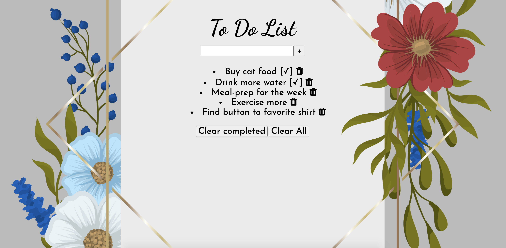

# To Do List
## Goal:

A simple to do list that allows the user to check completed tasks as well as clear them and delete all tasks.

## Installation

1. Clone repo
2. run `npm install`

## Usage

1. run `node server.js`
2. Navigate to `localhost:3000`
